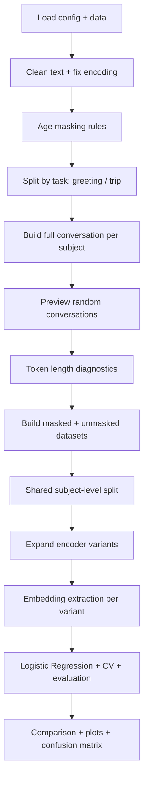
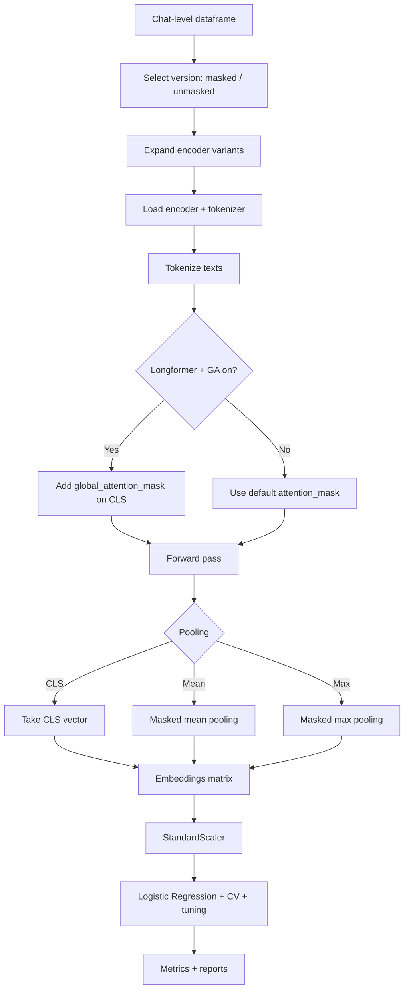

# Notebook flow (focus on embeddings)

This document summarizes the end-to-end flow of the notebook with extra detail on the embedding pipeline and model-specific handling.

## High-level flow

## Embedding pipeline (detailed)

## Key embedding logic

- `ENCODER_SPECS` defines each model name, `max_length`, and default global attention setting.
- `expand_embedding_variants()` generates variants for pooling (`cls`, `mean`, `max`) and Longformer GA on/off, producing `run_label` strings.
- `get_embeddings()` runs batched tokenization and forward passes, then applies pooling.
- `global_attention_mask` is only added for Longformer when `use_global_attention=True` and is applied to the CLS token.
- Embeddings are standardized and fed into Logistic Regression with cross-validation and light tuning.

## Where each stage lives in the notebook

- Data cleaning + masking: early cells after file upload.
- Conversation building: `build_full_conversation()` and `build_conversation_df()` cells.
- Token length diagnostics: token counting cell using Longformer/BigBird/LED/Long-T5/RoBERTa tokenizers.
- Balanced split: subject-level stratified split cells.
- Embedding extraction: `get_embeddings()` and `run_single_experiment()` cells.
- Evaluation: results tables, plots, heatmap, confusion matrix.

## Notes specific to Longformer

- Longformer is evaluated with global attention both on and off the CLS token.
- Pooling is tested with `cls`, `mean`, and `max`, and each variant is tracked via `run_label`.
