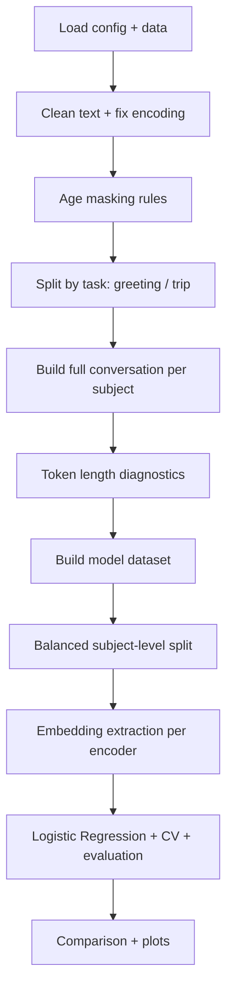
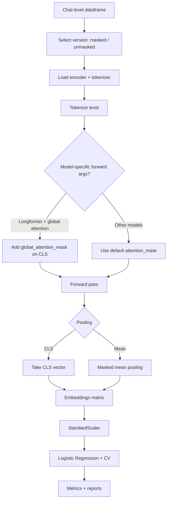

# Notebook flow (focus on embeddings)

This document summarizes the end-to-end flow of the notebook with extra detail on the embedding pipeline and model-specific handling.

## High-level flow

## Embedding pipeline (detailed)

## Key embedding logic

- `ENCODER_SPECS` defines each model name, `max_length`, whether to use global attention, and pooling strategy.
- `get_embeddings()` runs batched tokenization and forward passes, then applies pooling.
- `global_attention_mask` is only added for Longformer when `use_global_attention=True` and is applied to the CLS token.
- Forward kwargs are filtered by model signature when needed, to avoid passing unsupported args.
- Embeddings are standardized and fed into Logistic Regression with cross-validation and light tuning.

## Where each stage lives in the notebook

- Data cleaning + masking: early cells after file upload.
- Conversation building: `build_full_conversation()` and `build_conversation_df()` cells.
- Token length diagnostics: token counting cell using Longformer/BigBird/LED/Long-T5 tokenizers.
- Balanced split: subject-level stratified split cells.
- Embedding extraction: `get_embeddings()` and `run_single_experiment()` cells.
- Evaluation: results tables, plots, confusion matrix.

## Notes specific to Longformer

- Longformer uses CLS pooling with global attention applied to CLS.
- This preserves the intended long-context representation and avoids losing meaning in global attention.
